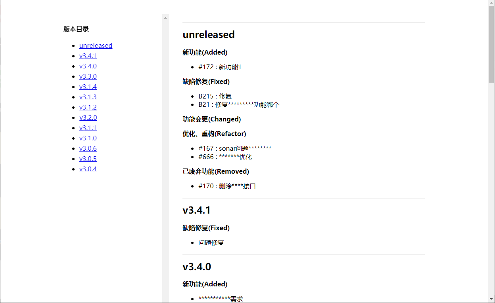

# changelog to html maven plugin

[TOC]

## 简介

- java web 项目 CHANGELOG.md 转换为 html 文件 maven 插件
- 用来将 CHANGELOG.md 转换为浏览器可访问的项目 version 文件
- CHANGELOG.md 文件内容编写参考 [keep a changelog](https://keepachangelog.com)
- 功能实现依赖 [<mark>flexmark-java</mark>](https://github.com/vsch/flexmark-java)

## 使用


```xml

<build>
    <plugins>
        <plugin>
            <groupId>world.weibiansanjue.maven</groupId>
            <artifactId>changelog2html-maven-plugin</artifactId>
            <version>${cl-version}</version>
            <executions>
                <execution>
                    <goals>
                        <goal>convert</goal>
                    </goals>
                </execution>
            </executions>
            <configuration>
                <inputFile>{project.basedir}/CHANGELOG.md</inputFile>
                <outputFile>${project.basedir}/web/version.html</outputFile>
                <title>version</title>
            </configuration>
        </plugin>
    </plugins>
</build>

```

- configuration
    - inputFile: CHANGLOG.md 文件路径
    - outputFile: html 文件路径
    - title: html 标题(title)


## CHANGELOG.md 模板

```markdown

<!-- ## unreleased / vX.Y.Z    -->
<!-- ### 新功能(Added)           -->
<!-- ### 缺陷修复(Fixed)          -->
<!-- ### 功能变更(Changed)        -->
<!-- ### 优化、重构(Refactor)      -->
<!-- ### 即将废弃功能(Deprecated)  -->
<!-- ### 已废弃功能(Removed)      -->
<!-- ### 安全问题修复(Security)    -->

## unreleased / vX.Y.Z

### 新功能(Added)

### 缺陷修复(Fixed)

### 功能变更(Changed)

### 优化、重构(Refactor)

### 即将废弃功能(Deprecated)

### 已废弃功能(Removed)

### 安全问题修复(Security)


```

## 效果


